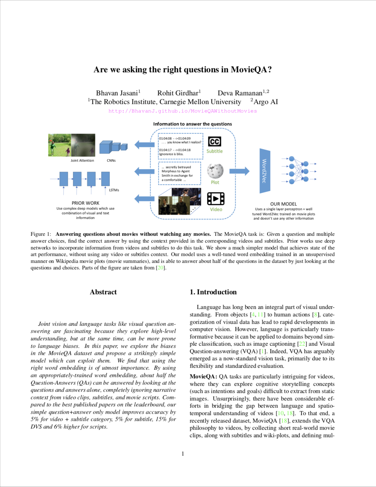

<!-- Taken from url=http://www.cs.cmu.edu/~dfouhey/3DP/index.html -->
<!DOCTYPE HTML>
<html xmlns="http://www.w3.org/1999/xhtml"><head>

<!-- Global site tag (gtag.js) - Google Analytics -->

  

<meta http-equiv="Content-Type" content="text/html; charset=UTF-8">
<link rel="StyleSheet" href="assets/style.css" type="text/css" media="all">

<title>Video Action Transformer Network</title>

<!-- bibliographic tags -->
<meta name="citation_title" content="Video Action Transformer Network"/>
<meta name="citation_author" content="Girdhar, Rohit"/>
<meta name="citation_author" content="Carreira, Joao"/>
<meta name="citation_author" content="Doersch, Carl"/>
<meta name="citation_author" content="Zisserman, Andrew"/>
<meta name="citation_publication_date" content="2019"/>
<meta name="citation_conference_title" content="CVPR"/>
<meta name="citation_pdf_url" content="https://arxiv.org/abs/1812.02707"/>

<link rel="icon" type="image/png" href="http://rohitgirdhar.github.io/favicon.png">

</head>
<body>

<h1 align="center" itemprop="name"><strong>
    Video Action Transformer Network
</strong></h1>

   <table class="results" align="center">
    <tr>
      <td align="center">
	      </a>
      </td>
    </tr>
    <tr></tr>
    <tr></tr>
    <tr></tr>
    <tr>
      <td class="credits" align="justify">
        We introduce the Action Transformer model for recognizing and localizing human actions in video clips. We repurpose a Transformer-style architecture to aggregate features from the spatiotemporal context around the person whose actions we are trying to classify. We show that by using high-resolution, person-specific, class-agnostic queries, the model spontaneously learns to track individual people and to pick up on semantic context from the actions of others. Additionally its attention mechanism learns to emphasize hands and faces, which are often crucial to discriminate an action - all without explicit supervision other than boxes and class labels. We train and test our Action Transformer network on the Atomic Visual Actions (AVA) dataset, outperforming the state-of-the-art by a significant margin using only raw RGB frames as input.
      </td>
    </tr>
    <tr>
    </tr>
 </table>

<h3>People</h3>

<table id="people" style="margin:auto;">
  <tr>
    <td></td>  <!-- For some reason it scales up the first td.. so adding a dummy td -->
    <td>
       
      <a href="http://www.cs.cmu.edu/~rgirdhar/" target="_blank">Rohit Girdhar</a>
    </td>
    <td>
       
      <a href="https://scholar.google.com/citations?user=IUZ-7_cAAAAJ&hl=en" target="_blank">João Carreira</a>
    </td>
    <td>
       
      <a href="http://www.carldoersch.com/" target="_blank">Carl Doersch</a>
    </td>
    <td>
       
      <a href="https://www.robots.ox.ac.uk/~az/" target="_blank">Andrew Zisserman</a>
    </td>

  </tr>
</table>

<h3>Paper</h3>
<table>
  <tr></tr>
  <tr><td>
    
  </td>
  <td></td>
  <td>
    R. Girdhar, J. Carreira, C. Doersch and A. Zisserman 
    <a href="http://arxiv.org/abs/1812.02707">Video Action Transformer Network</a> 
    IEEE/CVF Conference on Computer Vision and Pattern Recognition (CVPR), 2019 <b>(Oral Presentation) </b> 
    [<a href="http://arxiv.org/abs/1812.02707">arXiv</a>]
    [<a href="assets/suppl/main.pdf">Supplementary</a>]
    [<a href="assets/suppl/pred.pdf">Per-class predictions</a>]
    [<a href="assets/video_present.mp4">5min video</a>]
    [<a href="https://www.youtube.com/embed/JwaBi_2JFeU?start=0&end=300">CVPR video</a>]
    [<a href="javascript:togglevis('girdhar2019video')" id="bibtex">BibTex</a>]    
    <table summary="Rank 1">
      <tr>
	<td></td>
  <td>Ranked <b>first</b> on the AVA (computer vision only) leaderboard of the   <a href="http://activity-net.org/challenges/2018/evaluation.html">ActivityNet Challenge 2018</a>! (As of November 2018)</td>
      </tr>
    </table>

</table>

<table class="bibtex" style="display:none" id="girdhar2019video"><tr><td>
<pre>
@inproceedings{girdhar2019video,
    title = {{Video Action Transformer Network}},
    author = {Girdhar, Rohit and Carreira, Jo\~{a}o and Doersch, Carl and Zisserman, Andrew},
    booktitle = {CVPR},
    year = 2019
}
</pre>
</td></tr></table>

<h3>Acknowledgements</h3>

Authors would like to thank Viorica Patraucean, Relja Arandjelović, Jean-Baptiste Alayrac, Anurag Arnab, Mateusz Malinowski and Claire McCoy for
helpful discussions and encouragement.

</body></html>
